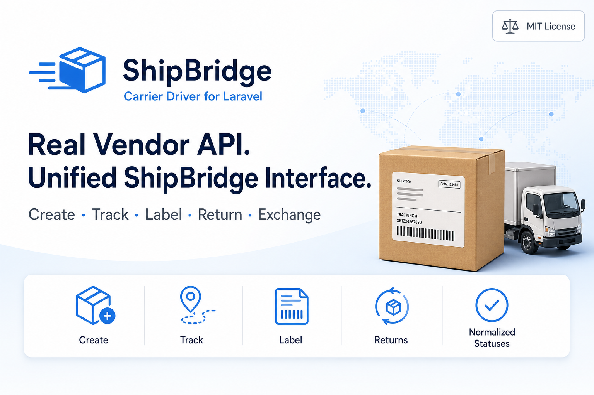
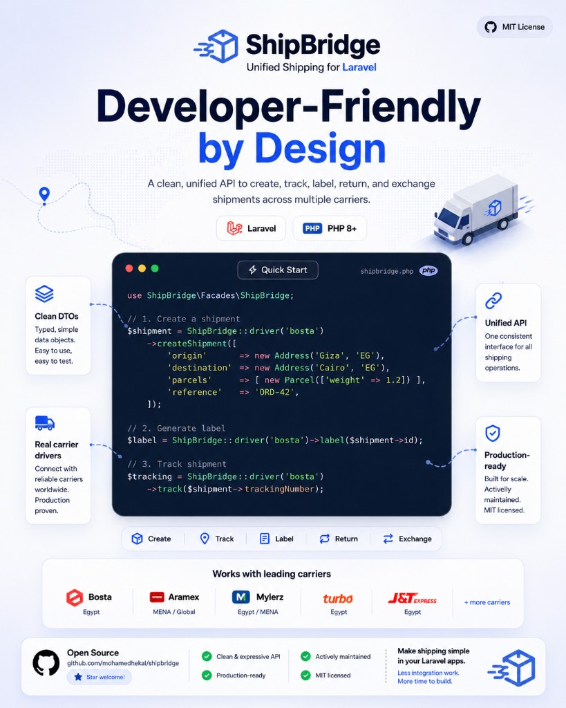
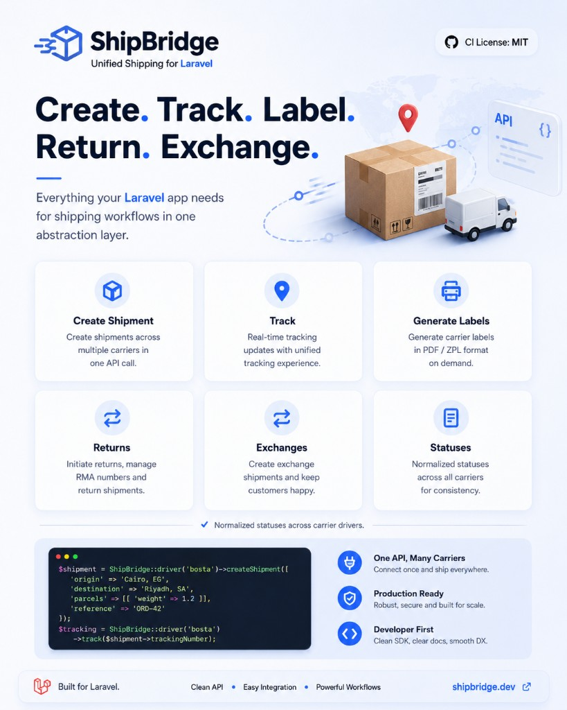

# ShipBridge · Egypt Post

<!-- shipbridge-marketing -->
<p align="center">
  
</p>

<p align="center">
  
</p>

<!-- /shipbridge-marketing -->


[](https://github.com/mohamedhekal/shipbridge-egyptpost/actions)
[](LICENSE)
[](https://packagist.org/packages/mohamedhekal/shipbridge-egyptpost)

**Egypt Post** shipping driver for [ShipBridge](https://github.com/mohamedhekal/shipbridge) · Region: **Egypt** / **مصر**

> **Honest limitation:** Egypt Post does not expose a public merchant create-shipment API. Merchants use the **Wassalha** app. This driver tracks via the official [TrackTrace](https://egyptpost.gov.eg/ar-eg/TrackTrace) endpoint and optionally routes create/label through a **partner B2B gateway** when you have one.

---

## بالعربي — في ٣ خطوات

### ١) ثبّت الحزمتين
```bash
composer require mohamedhekal/shipbridge mohamedhekal/shipbridge-egyptpost
```

### ٢) اختار الوضع

**تتبع فقط** (الافتراضي بدون API key):
```env
SHIPBRIDGE_DRIVER=egyptpost
EGYPTPOST_MODE=track_only
```

**بوابة شريك B2B** (إنشاء + تتبع):
```env
SHIPBRIDGE_DRIVER=egyptpost
EGYPTPOST_MODE=partner
EGYPTPOST_API_KEY=your-partner-key
EGYPTPOST_BASE_URL=https://your-gateway.example/v1
```

> الدليل العربي الكامل: [`docs/GUIDE_AR.md`](docs/GUIDE_AR.md)

### ٣) تتبع شحنة
```php
use Hekal\ShipBridge\Facades\ShipBridge;

$tracking = ShipBridge::driver('egyptpost')->track('EP123456789');
$label = ShipBridge::driver('egyptpost')->label('EP123456789'); // public track URL in track_only
```

إنشاء شحنة (partner فقط):
```php
use Hekal\ShipBridge\DTOs\Address;
use Hekal\ShipBridge\DTOs\CreateShipmentRequest;
use Hekal\ShipBridge\DTOs\Parcel;

$shipment = ShipBridge::driver('egyptpost')->createShipment(new CreateShipmentRequest(
    origin: new Address('المخزن', 'شارع ١', 'القاهرة', 'EG'),
    destination: new Address('العميل', 'شارع النيل', 'الجيزة', 'EG', phone: '01000000000'),
    parcels: [new Parcel(weightKg: 1.2)],
    reference: 'ORD-42',
));
```

---

## English — Quick start

```bash
composer require mohamedhekal/shipbridge mohamedhekal/shipbridge-egyptpost
```

```env
# Track only (no public create API)
EGYPTPOST_MODE=track_only

# Or partner gateway when you have a B2B contract
EGYPTPOST_MODE=partner
EGYPTPOST_API_KEY=your-key
EGYPTPOST_BASE_URL=https://your-gateway.example/v1
```

```php
ShipBridge::driver('egyptpost')->track('BARCODE');
ShipBridge::driver('egyptpost')->label('BARCODE');   // track URL or partner PDF
ShipBridge::driver('egyptpost')->createShipment(...); // partner mode only
```

See [`docs/API.md`](docs/API.md) for endpoints and payload shapes.

## How it fits

```
Your Laravel app
      │
      ▼
 ShipBridge  (one API for all carriers)
      │
      ├─► egyptpost.gov.eg TrackTrace  (track — always)
      └─► partner REST gateway       (create — optional)
```

## Testing

```bash
composer install && composer test && composer analyse && composer format
```


---

<p align="center">
  
</p>

## License

MIT © Mohamed Hekal
